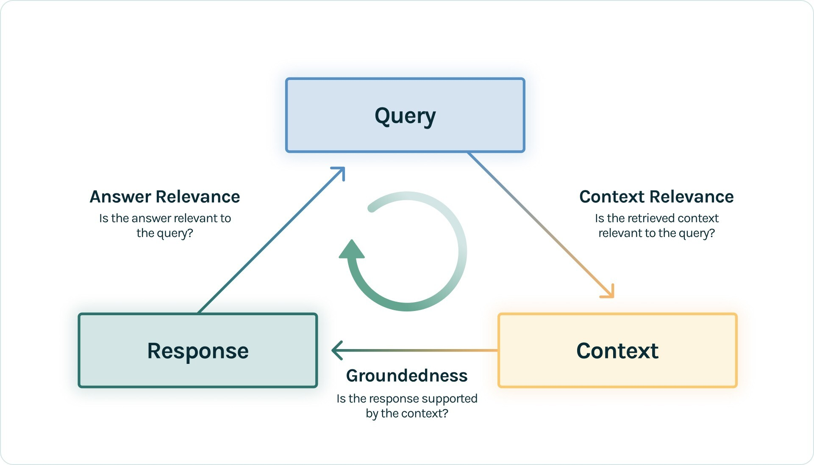

These notes are taken from this free course: <https://learn.deeplearning.ai/courses/building-evaluating-advanced-rag/lesson/1/introduction>

Huge thanks to the folks at <DeepLearning.ai>

## Introduction 

To productionize a high quality RAG system you need:
* Advanced retrieval techniques to get highly relevant sources
* Automated evals to measure responses

Goal of the course: Teach you how to build production ready LLM based system

Course covers:
* Advanced RAG
    * [Sentence Window Retrieval](#sentence-window-retrieval)
    * [Auto Merging Retrieval](#auto-merging-retrieval)
* Evaluations (the RAG triad) 
    * Context Relevance
    * Groundedness
    * Answer Relevance

## Advanced RAG Pipeline

### Overview of simple (naive) RAG pipeline

1) Ingestion: Take a doc -> chunk it up -> embed the chunks -> store them in an index

2) Retriever: Takes a query -> grabs top matches from the vector store index -> passes them back to the LLm to respond

### Sentence Window Retrieval

Gives an LLM extra context by retrieving, in addition to the most relevant sentence, the window of context around it. Sentence window retrieval is as a result, more efficient than the direct query engine. 

### Auto Merging Retrieval

Organizes the document in a tree like structure where each parent's nodes text is divided among its child nodes. If a child node is identified as relevant, then the entire text of the parent node is provided. It is a retrieval method that involves breaking text down into even smaller chunks than that of sentence window retrieval in a hierarchical manner. Nodes containing relevant chunks data are concatenated into one comprehensive response.

### Overview of Evals

The RAG Triad
* Query 
* Response
* Context

We use LLms to evaluate LLMs. Generally the steps to running an eval are:
* Write a list of questions to run against your RAG pipeline
* Use your eval engine of choice to run each of the questions in your list against your RAG pipeline
  * The eval engine, such as trulens_evals, will evaluate each query and the context it sourced through the RAG process to generate scores for the RAG triad metrics

  Evals are crucial in detecting hallucinations in our RAG process and *especially* for preventing them from slipping in after future changes. 

  
Extra sources:

* https://www.trulens.org/trulens_eval/getting_started/core_concepts/rag_triad/
